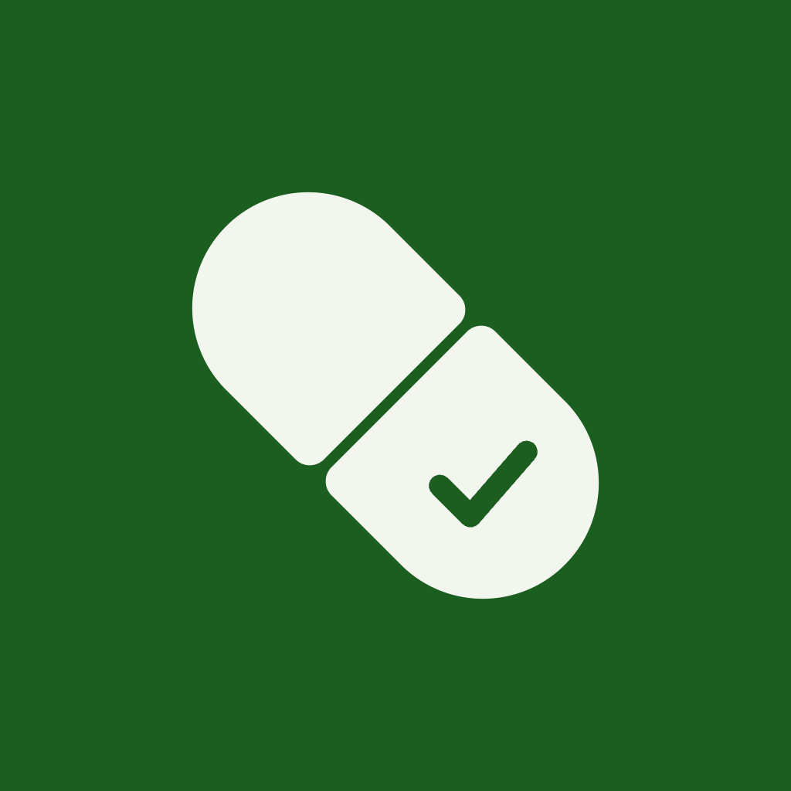

<p align="center">
  
</p>

<h1 align="center">RecordaMed</h1>

<p align="center">
  Recordatorio de medicamentos para personas mayores y pacientes crónicos, pensado para dar tranquilidad — a quien lo toma y a quien lo cuida.
</p>

<p align="center">
  
  
  
  
</p>

---

## Concepto

RecordaMed nace para resolver un problema muy concreto: ayudar a que alguien mayor o con un tratamiento crónico no pierda una toma de medicamento, sin que la app se sienta invasiva, complicada o alarmante. El diseño parte de tres ideas fijas:

- **Calma antes que urgencia.** Las alarmas y recordatorios buscan tranquilizar, no asustar — colores cálidos, vibración suave, notas de voz grabadas por un familiar en lugar de un tono genérico.
- **Todo funciona sin conexión.** No requiere cuenta, ni internet, ni servidor: los medicamentos, horarios y el historial de tomas viven únicamente en el dispositivo.
- **Gratis siempre, sin letras chiquitas.** Ninguna función queda detrás de un pago. Si en el futuro hay alguna forma de apoyar el proyecto, será estrictamente opcional (donación tipo "tip jar"), nunca un candado sobre una función.

El proyecto está en desarrollo activo — se construye y prueba de forma iterativa, probando cada cambio en dispositivos reales.

## Funcionalidades

- Registro de medicamentos con dosis, instrucciones y horario (fijo o por intervalo, p. ej. "cada 8 horas").
- Tratamientos temporales (con fecha de fin) o permanentes.
- Alarmas exactas y confiables incluso con la pantalla apagada o en modo No Molestar, con reintento automático (snooze) limitado.
- Nota de voz personalizada por medicamento, o sonido integrado a elegir.
- Pantalla principal con las próximas tomas ordenadas por cercanía y estado (pendiente, atrasada, completada).
- Historial con mapa de calor de adherencia (estilo "contribuciones" de GitHub) y detalle por día.
- Soporte para tablet y orientación horizontal.
- Temas claro y oscuro cuidados para que el texto y los colores de estado siempre se lean bien.

## Stack técnico

| Componente | Tecnología |
|---|---|
| Lenguaje | Kotlin 2.2.10 |
| UI | Jetpack Compose (BOM 2026.02.01) + Material 3 |
| Persistencia | Room (SQLite) |
| Concurrencia | Coroutines + Flow (`StateFlow`, `combine`) |
| Navegación | Navigation Compose |
| Alarmas | `AlarmManager` (exactas, con notificación de pantalla completa) |
| Build | Gradle 9.4.0 (AGP), KSP |
| Mín. Android | API 26 (Android 8.0) · Objetivo: API 37 |

Este repositorio también incluye, en `.agents/skills/` y `.claude/skills/`, las [skills de Claude Code](https://github.com/chrisbanes/skills) usadas para trabajar en Kotlin/Compose con ayuda de IA — no son parte de la app, solo herramientas de desarrollo.

## Cómo clonarlo, compilarlo y probarlo en local

### Requisitos

- [Android Studio](https://developer.android.com/studio) (versión reciente, con soporte para AGP 9.4 / Kotlin 2.2).
- JDK 17 (Android Studio suele incluir uno compatible).
- Un dispositivo físico o un emulador con **Android 8.0 (API 26) o superior**.

### 1. Clonar el repositorio

```bash
git clone https://github.com/RicardoMonroy/RecordaMed.git
cd RecordaMed
```

### 2. Abrir el proyecto

Abre la carpeta `RecordaMed` desde **Android Studio → Open** y espera a que termine la sincronización de Gradle (la primera vez descarga dependencias, puede tardar unos minutos).

> `local.properties` no viene en el repositorio (es específico de cada máquina). Android Studio lo genera solo al detectar tu SDK de Android; si no lo hace, créalo a mano en la raíz del proyecto con una línea `sdk.dir=/ruta/a/tu/Android/sdk`.

### 3. Compilar desde la terminal (opcional)

```bash
# macOS / Linux
./gradlew assembleDebug

# Windows
gradlew.bat assembleDebug
```

El APK de depuración queda en `app/build/outputs/apk/debug/app-debug.apk`.

### 4. Probarlo

- **Desde Android Studio**: selecciona un dispositivo/emulador y pulsa ▶️ Run.
- **Instalar manualmente el APK generado**:
  ```bash
  adb install app/build/outputs/apk/debug/app-debug.apk
  ```

Para probar las alarmas de forma realista, usa un dispositivo (o emulador) con la pantalla apagada y revisa que los permisos de notificaciones, alarmas exactas y "aparecer sobre otras apps"/pantalla completa estén concedidos — Android los pide la primera vez que se programa una alarma.

## Estructura del proyecto

```
app/src/main/java/com/example/recordamed/
├── data/            # Entidades Room, DAOs y repositorio
├── domain/model/    # Modelos usados por la UI
├── receiver/        # BroadcastReceivers (alarmas, arranque del dispositivo)
├── service/         # Programación de alarmas, audio, notificaciones
└── ui/
    ├── navigation/  # Navigation Compose
    ├── screens/     # Home, alta/edición, detalle, historial, alarma
    └── theme/       # Colores y tipografía (tema claro/oscuro)
```

## Estado y hoja de ruta

- **Fase 1 (actual)**: app 100% local, un solo dispositivo, sin cuentas ni red.
- **Fase 2 (planeada)**: modo cuidador opcional — un familiar se vincula por código y solo recibe aviso si una toma no se registró.
- **Fase 3 (opcional)**: capa de donación voluntaria, sin gating de funciones.

---

<p align="center">Hecho con cariño para que nadie olvide una toma. 💊</p>
